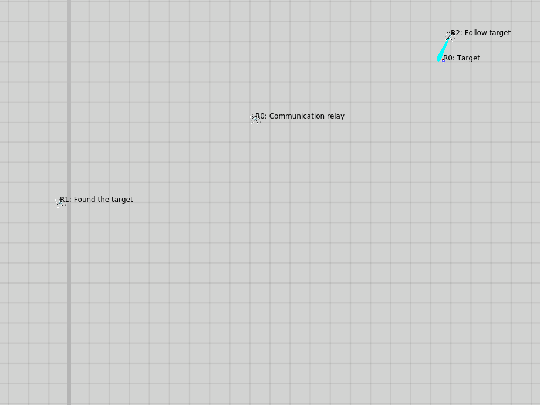

## Docker instructions (build and execution)
Look [here](docker/devel/instructions.md) for the build and execution using Docker which is definitely the easiest way to proceed. It should work on most Linux distributions.

To install Docker on a Ubuntu machine, look [here](https://docs.docker.com/engine/install/ubuntu/).

To pull the docker image:
```
docker pull lajoiepy/drones-search-and-rescue
```
## Robots + Sensing
The flying robots in the simulation are the Spiri model in ARGoS (https://github.com/lajoiepy/argos3/tree/master/src/plugins/robots/spiri) and the target is the foot-bot (https://github.com/lajoiepy/argos3/tree/master/src/plugins/robots/foot-bot). You can modify their attributes in their respective source files. You will need to rebuild and install ARGoS to see the effects.

The sensing on the drones is a simulated blob detection using a downward-facing camera.


## Available simulations
### Search example
The only simulation currently available is a basic random search with a moving target.
Look at this [powerpoint presentation](https://drive.google.com/file/d/1vOhjvG5sr929v2155TVERvIOgHaiopc5/view?usp=sharing) for detailed explanations.

The simulation parameters can be edited in this [file](argos_simulation/config/search_example/parameters.bzz). Don't forget to rebuild the Buzz files after any modification to see their effects.
```
    bzzc argos_simulation/search_example.bzz
    bzzc argos_simulation/target_drift_example.bzz
```
Configurations with respect to the simulation arena need to be also changed in the `.argos` [file](argos_simulation/search_example.argos).

At the end of the simulation you should expect this kind of result where the drones establish a communication link from the meeting point to the target:

A short video showing the execution is also available in the `media` folder.